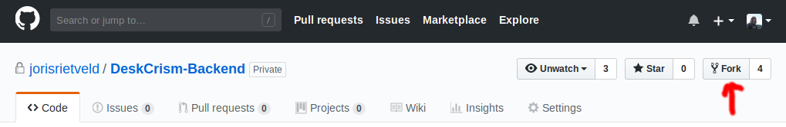
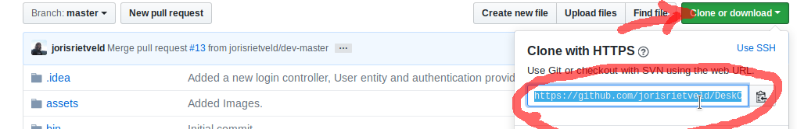
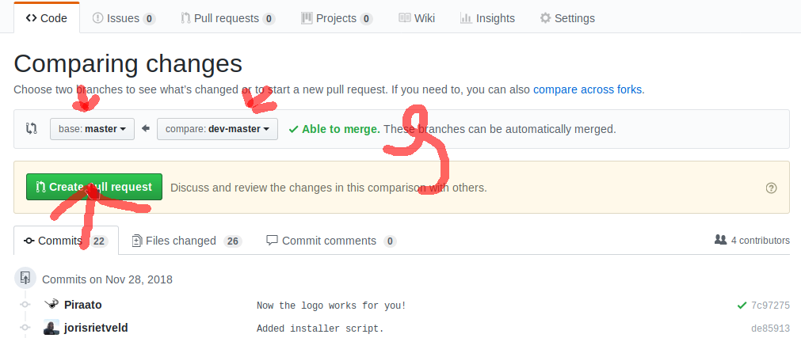
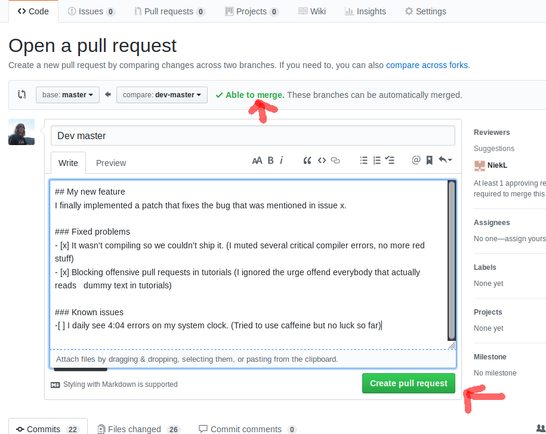

# Working with version control

[TOC]: # "Table of contents"

## Table of contents
- [Cloning, updating, pushing and pulling](#cloning-updating-pushing-and-pulling)
- [Cloning for production](#cloning-for-production)
- [Forking for development](#forking-for-development)
    - [Updating your fork](#updating-your-fork)
- [Committing and pushing](#committing-and-pushing)
- [Creating a pull request](#creating-a-pull-request)

## Cloning, updating, pushing and pulling
The first step of installing the application is cloning the repository
from github. If you want to develop new features and add them to the
master-dev repository, you should firstly fork the project and push
changes to your own fork. When you have tested your changes and want to
share them back to the main repository you can submit a pull-request to
dev-master. The repository maintainer checks your code and if correct
merge them. Its much easier for the maintainer if you create own fork
and commit your changes there until you are done building/solving the
thing your wanted to add, and then create 1 pull request to merge all
the commits you did so it can be reviewed in one go.

## Cloning for production
If you want to setup a production server you should clone the project
directly from an certain release or the `master` branch. The master
branch will be less stable then a release because changes from
`dev-master` are directly merged into it.

**Cloning the repository and
checking out a release or branch**
https://github.com/jorisrietveld/DeskCrism-Backend
```bash
# Cloning the repository 
$ git clone https://github.com/jorisrietveld/DeskCrism-Backend.git

# Checking out a specific release or branch  
$ git checkout tags/<branch_name_or_release_number> -b <your_local_branch_name>
```

**Alternatively, you can also clone a specific release or branch**

```bash
$ git clone https://github.com/jorisrietveld/DeskCrism-Backend.git --depth 1 -b <release-number>
```

## Forking for development
To start contributing to the project you firstly create your own fork
where you can commit and push changes to. To fork the project, open your
web browser and head on to
[the Desk CriSim repository](https://github.com/jorisrietveld/DeskCrism-Backend).
On the right-top corner, just below the main navbar there is a button
that lets you do that. 

Press it and it will fork the repository to your
own account. when its done you can copy the url of your fork by pressing
on the green "Clone/Download" button on your forks page.


### Updating your fork
Before starting to work on a new feature in your fork, its a good idea
to update it to the most recent version that include changes made by
other collaborators. When you "Update" or "Pull" the project with git it
will get the latest version from "remote". By default your remote will
be your fork and you will find that all files are always up-to-date
while and that there are no commits done by others. This is because you
should add the original project, where you forked from as an remote.
Usually this remote is called upstream and this is also necessary if you
want to create pull request to the main project.

```bash
# If you want to check if the remote is already added you can run:
$ git remote -v

# Add the new remote if it doesn't exist.
$ git remote add upstream https://github.com/jorisrietveld/DeskCrism-Backend.git

# Check again?
$ git remote -v

```

After you added the upstream repository as an remote it will still not
update anything when pulling or updating. You need to fetch the commit
info from the upstream repository first, so type:

```bash
# Fetch from the upstream repo
git fetch upstream

# Now checkout your dev-master branch locally.
git checkout dev-master
```
<!--git merge upstream/master-->
## Committing and pushing
During the development of an feature or bug-fix its good practice to
commit it to your local repository so that git can track it, giving you
a timeline with code updates and a good way to figure out where
something went wrong. After a few commits your addition is finished (and
unit tested) so you can push it to your fork and check if it is able to
merge.

```bash
# You are in the root directory of the project. You have committed serveral times with:
$ git commit -m "Added commic-sans to the :root{} and *{} css selector of the site"
$ git commit -m "Replaced all abstract div elements with giant table in table magic"
$ git commit -m "Replaced all materialize icons with animated gifs that may trigger Epilepsy"

# Done committing you are ready to push it to your fork on github.
$ git push
```

If its not merge-able see
[this tutorial about solving a merge conflict]() otherwise you can
submit the changes back to upstream repository in the dev-master branch
by opening a pull request from the browser.

## Creating a pull request
Go to the upstream repository on github and click on pull-request's in
the menu below the navbar.

Then click on create a pull request

and add a description containing the reason of the request and what it solves or adds to the
project.

After creating the request you will see an Travis CI process running, this is the
Continues Integration tool we use for automated testing on each commit in `dev-master`
and `master`. Travis will check your submitted code on smell, security issues,
documentation, the unit tests, and lots validation for Yaml, XML, XLF, Twig templates,
package.json, composer.json, composer.lock, webpack.config.js. It will also check
the projects dependencies for known security bugs online. If the travis CI logo
turns green your good to go, if it goes red you need to click on the build and
view the log to find out what you broke. You can still force push to `dev-master`
and break everybody code but under the tab commits everybody can see your name
with a big red cross next to it, it will cost you, you have to bring cake.
If you locate the issue with your you can cancel the previous pull request and
create a new one, with the issues solved.


**todo add a few images with instructions**

# With PhpStorm

Todo finish the docs for PHPStrom

<!--
## Cloning for production
## Forking for development
## Updating your fork
## Commiting
## Creating a pull request
-->


<hr>
This page is licensed under a <a rel="license" href="http://creativecommons.org/licenses/by-sa/4.0/">Creative Commons Attribution-ShareAlike 4.0 International License</a>.

[](https://github.com/jorisrietveld)
[](https://creativecommons.org/licenses/by-sa/4.0/)

