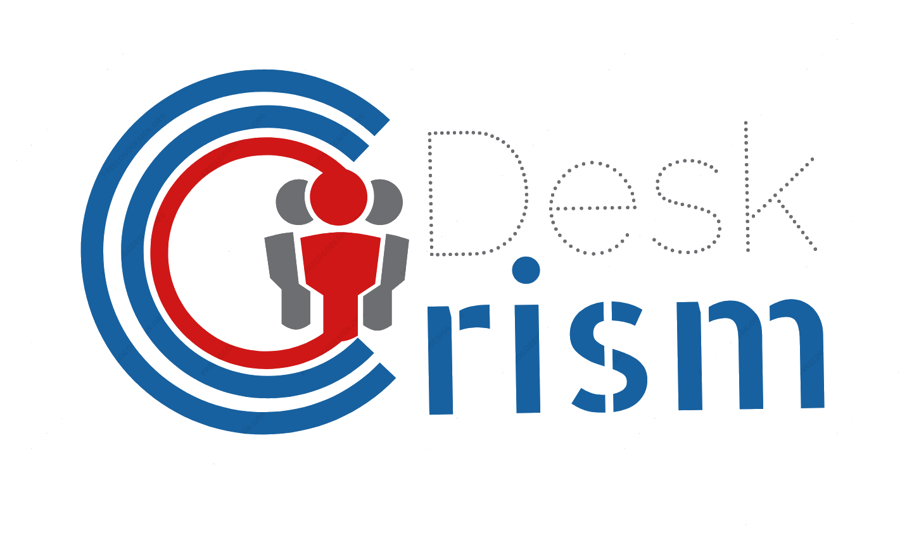

# Desk CriSim
Master:
[](https://travis-ci.com/jorisrietveld/DeskCrism-Backend)
Dev-Master:
[](https://travis-ci.com/jorisrietveld/DeskCrism-Backend)



This repository holds the source code of the crisis simulation game: Desk Crisim. Desk CriSim is a web application that allows students to simulate
crisis situations. Teachers can assign students as certain actors in a crisis situation and monitor the choices that the students make on events that
happen during a crisis.


## Installing
[**To much text, take me to the quick setup!**](##quick-setup)

The application is platform independent and should run on Linux :penguin:, Mac OS and even
 on windows. However our production server and automated tests (Unit tests, security tests, continues integration and
 code quality tests) run on Linux servers [_(specificly: Ubuntu 18.04/18.10)_](https://www.ubuntu.com/#download).
 This means that it is guarantied to work on Linux, because we would catch the failing builds. This is also our initial target setup
 for the production server. It should also work on any unix-like operating system like BSD or Mac OSX but you should validate that your
 php version is compiled with the same arguments as the version in the ubuntu repositories and that you have the correct php extensions installed.

The main programming language of the project is PHP and Java script, but also builds on: (X)HTML, Twig, Markdown, XML, CSS and SCSS mainly for
the presentation of the application. For faster development we choose to use the symfony framework instead of rolling our own. This means that
the project has to install several dependencies in order to run. [Composer](https://getcomposer.org/) is a widely used dependency manager for PHP that can install the
required dependencies using the configuration in `./composer.json` [see this]() for information about installing composer.

For loading, pre-proccessing and compiling the front-end components we use the [webpack](https://webpack.js.org/)
and the [yarn package manager](https://yarnpkg.com/en/) based on nodeJS. It is not required to be installed on a production server but it is
certainly easier to install or update the application later on. Storing data can be done on every database server that is compatible with
[doctrine ORM]() by configuring your database connection parameters in `.local.env` or by setting them as environment variables. Make sure
that you don't include them in version control! during development we use [MySQL 5.7](https://dev.mysql.com/downloads/mysql/) but any later
version will do, previous versions are also possible but require you to alter the doctrine settings because 5.7 introduced the json field type
that is used in the application.

Because the routes in the application are dynamically matched inside of the application, it needs a rewrite capable webserver like: [nginx]() or
[apache](http://httpd.apache.org/) (with [mod_rewrite](https://httpd.apache.org/docs/2.2/mod/mod_rewrite.html)) including some with [special configuration]() for it to function properly.

### Read detailed instructions on:
- [**Cloning & opening the project**](documentation/cloning_the_project.md)
    - [From the commandline](/documentation/cloning_the_project.md#)
    - [From PHPStorm]()
- [**The structure of the project**]()
    - [The directory structure]()
    - [Images, stylesheeds, javascript and templates]()
    - [Controllers, services and configuration]()
    - [Entity mapping for database storage]()
    - [Translations & localization]()
- [**Installing a development, test and production server**]()
    - [Installing PHP and the required PHP extentions]()
    - [Installing a database server]()
    - [Installing a web server]()
    - [Installing the dependency manangers]()
    - [Installing the dependencies]()
    - [Generating web assets]()
- [**Setting up the development enviroment**]()
    - [Setting up the database]()
    - [Setting up testing (Unit tests, Security tests and Continues Integration]()
    - [Installing additional plugins in PHPStrom ]()
- [**Running & debugging the application**]()
    - [Running a production server]()
    - [Running a development server]()
    - [Running a automated tests]()

## Quick setup
One liner on linux:
```bash
#For installing the server:
apt install php7.2-{soap,dev,fpm,xml,intl,xmlrpc,json,cli,common,curl,mbstring,opcache,readline} mysql-server nginx                
# For installing the project
composer install && composer update && yarn install && yarn run encore --dev
```
### Step 1
First clone the repository from github:
```bash
$ git clone https://github.com/jorisrietveld/DeskCrism-Backend.git
```
### Step 2
After that change the directory to the project root:
```bash
$ cd DeskCrisim-Backend
```
### Step 3
Now install the required composer dependencies:
```bash
$ composer install
```
### Step 4
and for the front-end packages, run:
```bash
$ yarn install
$ yarn run encore --dev
```

## Running
### Yarn
I have created several yarn scripts to run webpack and php servers for
development.
To run webpack for asset compilation run `webpack-run` from PhpStorm or with
the commandline:
```bash
$ yarn run webpack-run
```
To watch files (watch for change) and automatic re compilation run `webpack-watch`
from PhpStorm or with the commandline:
```bash
$ yarn run webpack-watch
```
To stop watching the assets run `webpack-watch`
                            from PhpStorm or with the commandline:
```bash
$ webpack-unwatch
```

### Php webserver from the commandline:
To run the php buildin webserver from the command-line, you can run:
```bash
$ bin/console server:run    # Optionally add a ip:port like, 127.0.0.1:8000
$ bin/console server:start  # Same as run, but runes in th background.
# or on windows:
$ php bin/console server:run
$ php bin/console server:start
```
To terminate the process when server:run is used you can just press `crtl+c` to exit, alternatively run:
```bash
$ bin/console server:stop
# or on windows:
$ php bin/console server:stop
```

## Required Dependencies
- \>= PHP 7.2 compiled with the `–with-password-argon2` flag. It is also
     possible **(But not recommended)** to run the application with php 7.2
     or even 7.1 without this flag but it requires you to change the password
     hashing configuration in  `./config/bundles/security.yaml`. Replace the
     line `algorithm: argon2` to  `algorithm: bcrypt`. [there are knows issues](#php-segfault)
    - #### Required Php modules:

  |             |              |               |                 |               |
  |:------------|:-------------|:--------------|:----------------|:--------------|
  | php-amqp    | php-fpm      | php-xdebug    | php7.2-dev      | php7.2-soap   |
  | php-apcu    | php-intl     | php-xml       | php7.2-fpm      | php7.2-xml    |
  | php-apcu-bc | php-json     | php-xmlrpc    | php7.2-intl     | php7.2-xmlrpc |
  | php-cli     | php-mbstring | php-zip       | php7.2-json     | php7.2-zip    |
  | php-common  | php-mongodb  | php7.2-cli    | php7.2-mbstring |               |
  | php-curl    | php-pear     | php7.2-common | php7.2-opcache  |               |
  | php-dev     | php-soap     | php7.2-curl   | php7.2-readline |               |
    - \>= Composer
- \>= Yarn package manger
    - \>= Npm
    - \>= NodeJS
    - \>= webpack
    - \>= SCSS

- Webservers:
    - \>= Nginx
    - \>= Apache
    - \>= IIS
- Database servers:
    - Mysql \>= 5.7 or MariaDB
    - \>= SQL Server
    - \>= Postgre
    - \>= SQLite

## The Project Team

 - **Front-end programmer** Lennart Pikijn [:email:](mailto:lennart.pikijn@student.stenden.com)
 - **secondary lead** Niek Luttikhof [:email:](mailto:niek.luttikhof@student.stenden.com)
 - **secretary** Soner Mulder [:email:](mailto:niek.luttikhof@student.stenden.com)
 - **Planner** Sander Paping [:email:](mailto:sander.paping@student.stenden.com)
 - **Project lead & Repository Manger** Joris Rietveld [:email:](mailto:joris.rietveld@student.stenden.com)

## Known issues
_Known issues in the project, please open a issue and if it is confirmed I will add it
in this list, so I can investigate and patch it_
##### PHP segfault
- [ ] The `bin/console server:run` command or the php deamon crashes when when a webpage is
served to the client.
    > If you don't change the `algorithm: argon2` line to `algorithm: bcrypt`
    when running a Php version that is compiled without the `-with-password-argon2`
    flag (libsodium). it will execute seeming without problems, but it will crash (Segfault) your
      entire php process when a page is served (sometimes it serves a error page
      with an unrelated error message and then segfault on the second request,
      _Still figuring out what causes this, it should not be possible_).

## Licencing
Desk CriSim - A crisis simulation game.
Copyright (C) 2018 Members of the INF2H project group

This program is free software: you can redistribute it and/or modify
it under the terms of the GNU General Public License as published by
the Free Software Foundation, either version 3 of the License, or
(at your option) any later version.

This program is distributed in the hope that it will be useful,
but WITHOUT ANY WARRANTY; without even the implied warranty of
MERCHANTABILITY or FITNESS FOR A PARTICULAR PURPOSE.  See the
GNU General Public License for more details.

You should have received a copy of the GNU General Public License
along with this program.  If not, see <http://www.gnu.org/licenses/>.